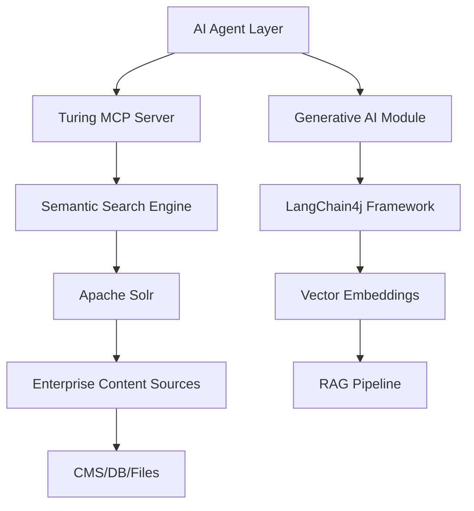

# AI Agents and Turing: Enterprise Search Intelligence Platform

## Overview

Viglet Turing is a comprehensive **Enterprise Search Intelligence Platform** that serves as an ideal foundation for AI agent systems focused on enterprise search and knowledge discovery. By combining semantic navigation, generative AI capabilities, and advanced search technologies, Turing provides the infrastructure needed for intelligent agents to interact with and understand enterprise content at scale.

## Why Turing for AI Agent Research?

### 1. **Semantic Understanding Foundation**
- **Semantic Navigation**: Advanced content understanding beyond keyword matching
- **Contextual Search**: AI agents can leverage contextual relationships between documents
- **Multi-language Support**: Global enterprise content accessibility
- **Intelligent Indexing**: Automatic content classification and relationship mapping

### 2. **Generative AI Integration**
- **LangChain4j Integration**: Built-in support for modern AI frameworks
- **RAG (Retrieval-Augmented Generation)**: Combines search with generative AI
- **Vector Embeddings**: Semantic similarity search capabilities
- **Conversational AI**: Chat-based interfaces for natural language queries

### 3. **Enterprise-Scale Architecture**
- **Distributed Search**: Apache Solr backend with horizontal scaling
- **Microservices Design**: Spring Boot architecture for modular AI agent development
- **MCP Server**: Model Context Protocol implementation for AI model integration
- **Real-time Processing**: Apache Artemis for asynchronous AI workflows

## AI Agent Capabilities Enabled by Turing

### Knowledge Discovery Agents
Turing enables AI agents that can:
- **Autonomous Content Discovery**: Automatically crawl and index enterprise content
- **Semantic Content Classification**: Use AI to categorize and tag documents intelligently
- **Cross-Source Knowledge Synthesis**: Combine information from multiple enterprise systems
- **Intelligent Content Recommendations**: Suggest relevant content based on user behavior and context

### Conversational Search Agents
- **Natural Language Query Processing**: Transform user questions into semantic search queries
- **Context-Aware Responses**: Maintain conversation history and context
- **Multi-turn Conversations**: Handle complex, multi-step information requests
- **Personalized Results**: Adapt responses based on user roles and permissions

### Enterprise Integration Agents
- **CMS Integration**: Automated content extraction from Adobe AEM, WordPress, and other CMS platforms
- **Database Query Agents**: Intelligent database search across MySQL, PostgreSQL, Oracle, SQL Server
- **File System Intelligence**: Smart document analysis and content extraction
- **API Orchestration**: Coordinate multiple enterprise APIs through intelligent workflows

## Technical Architecture for AI Agents

### Core Components Supporting AI Agents



### Key Technologies
- **Spring Boot 3.2+**: Microservices foundation for AI agent development
- **Java 21**: Modern language features for AI algorithm implementation  
- **LangChain4j**: AI/ML framework integration
- **Apache Solr**: High-performance search engine
- **Apache Artemis**: Message queue for asynchronous AI processing
- **React + TypeScript**: Modern UI for AI agent interfaces
- **Docker & Kubernetes**: Containerized deployment for scalable AI workloads

## SDK and API Support for Agent Development

### Java SDK for AI Agents
```java
// Example: AI Agent using Turing Java SDK
HttpTurSNServer turSNServer = new HttpTurSNServer("http://localhost:2700/api/sn/MySite");

// Semantic search query from AI agent
TurSNQuery query = new TurSNQuery();
query.setQuery("artificial intelligence best practices");
query.setRows(10);
query.setSemanticSearch(true);

// Process results with AI context
QueryTurSNResponse response = turSNServer.query(query);
// AI agent can now process and synthesize results
```

### JavaScript SDK for Web-based Agents
```typescript
// Example: Web-based AI Agent
import { TurSNSiteSearchService } from '@openviglet/turing-js-sdk';

class AISearchAgent {
  private searchService: TurSNSiteSearchService;
  
  constructor(baseURL: string) {
    this.searchService = new TurSNSiteSearchService(baseURL);
  }
  
  async intelligentSearch(userQuery: string, context?: AgentContext) {
    const results = await this.searchService.search('enterprise-site', {
      q: userQuery,
      rows: 20,
      semanticSearch: true,
      localeRequest: context?.locale || 'en_US',
    });
    
    return this.synthesizeResponse(results, context);
  }
}
```

### REST API for Agent Integration
```bash
# AI Agent making semantic search requests
curl -X POST "http://localhost:2700/api/sn/enterprise-site/search" \
  -H "Content-Type: application/json" \
  -d '{
    "userId": "ai-agent-001",
    "query": "machine learning deployment strategies",
    "populateMetrics": true,
    "semanticSearch": true,
    "aiContext": {
      "conversationId": "conv-123",
      "userRole": "data-scientist"
    }
  }'
```

### GraphQL for Complex Agent Queries
```graphql
query AIAgentComplexSearch($siteName: String!, $query: String!, $context: AgentContextInput) {
  siteSearch(siteName: $siteName, searchParams: {
    q: $query
    rows: 50
    semanticSearch: true
    aiEnhanced: true
  }, context: $context) {
    queryContext {
      count
      responseTime
      semanticScore
    }
    results {
      document {
        fields {
          title
          text
          url
          semanticRelevance
          aiClassification
        }
        aiSummary
        relatedConcepts
      }
    }
    aiInsights {
      topicClusters
      sentimentAnalysis
      knowledgeGaps
    }
  }
}
```

## Research Applications and Use Cases

### 1. **Enterprise Knowledge Management**
- **Research Focus**: How AI agents can automatically organize and contextualize enterprise knowledge
- **Turing Advantage**: Semantic navigation enables agents to understand document relationships
- **Implementation**: [PLACEHOLDER - specific research methodologies and metrics]

### 2. **Intelligent Information Retrieval**
- **Research Focus**: Beyond traditional search - understanding intent and context
- **Turing Advantage**: Generative AI integration for query understanding and response synthesis
- **Implementation**: [PLACEHOLDER - evaluation frameworks for search intelligence]

### 3. **Multi-Source Data Fusion**
- **Research Focus**: How AI agents can synthesize information from disparate enterprise systems
- **Turing Advantage**: Native connectors to CMS, databases, file systems
- **Implementation**: [PLACEHOLDER - data fusion algorithms and evaluation metrics]

### 4. **Conversational Enterprise Search**
- **Research Focus**: Natural language interfaces for complex enterprise queries
- **Turing Advantage**: Built-in chatbot framework with context awareness
- **Implementation**: [PLACEHOLDER - conversation flow optimization strategies]

## Deployment and Scalability for AI Workloads

### Container-Based Deployment
```yaml
# Docker Compose for AI Agent Development
version: '3.8'
services:
  turing-ai-platform:
    image: openviglet/turing:latest
    environment:
      - AI_ENABLED=true
      - LANGCHAIN_API_KEY=${LANGCHAIN_API_KEY}
      - VECTOR_STORE=chroma
    ports:
      - "2700:2700"
    depends_on:
      - turing-solr
      - turing-db
      - ai-vector-store
```

### Kubernetes for Production AI Agents
- **Horizontal Pod Autoscaling**: Scale AI workloads based on query load
- **GPU Support**: Integration with CUDA for AI model processing
- **Service Mesh**: Istio integration for AI agent communication
- **[PLACEHOLDER - specific K8s configurations for AI workloads]**

## Performance Characteristics for AI Applications

### Search Performance
- **Sub-second Response Times**: Critical for real-time AI agent interactions
- **Concurrent Query Support**: Handle multiple AI agents simultaneously
- **Semantic Query Optimization**: [PLACEHOLDER - specific optimization techniques]

### AI Processing Metrics
- **Vector Embedding Performance**: [PLACEHOLDER - benchmarking data]
- **RAG Pipeline Latency**: [PLACEHOLDER - performance characteristics]
- **Model Inference Times**: [PLACEHOLDER - GPU vs CPU performance]

## Integration with AI/ML Frameworks

### Supported AI Frameworks
- **LangChain4j**: Primary integration for AI agent development
- **Spring AI**: Enterprise AI application development
- **[PLACEHOLDER - other supported frameworks like Hugging Face, OpenAI API]**

### Model Integration
- **Local Model Support**: Run AI models within the Turing infrastructure
- **Cloud API Integration**: Connect to OpenAI, Claude, Gemini APIs
- **Custom Model Deployment**: [PLACEHOLDER - guidelines for custom model integration]

## Research Data and Benchmarks

### Performance Benchmarks
- **Search Accuracy**: [PLACEHOLDER - precision/recall metrics]
- **Response Time**: [PLACEHOLDER - latency distributions]
- **Scalability Metrics**: [PLACEHOLDER - concurrent user/agent limits]

### Research Datasets
- **Enterprise Content Corpora**: [PLACEHOLDER - anonymized datasets for research]
- **Query Logs**: [PLACEHOLDER - search behavior analysis data]
- **Evaluation Frameworks**: [PLACEHOLDER - standardized evaluation methodologies]

## Security and Privacy for AI Agents

### Enterprise Security Features
- **Authentication**: Keycloak integration for AI agent identity management
- **Authorization**: Role-based access control for AI agent permissions
- **Audit Logging**: Track AI agent actions and data access
- **Data Privacy**: [PLACEHOLDER - GDPR/privacy compliance features]

### AI-Specific Security
- **Model Security**: Prevent AI model poisoning and adversarial attacks
- **Data Isolation**: Ensure AI agents only access authorized content
- **[PLACEHOLDER - additional AI security measures]**

## Community and Collaboration

### Research Collaboration Opportunities
- **Open Source**: Apache 2.0 license enables research collaboration
- **Academic Partnerships**: [PLACEHOLDER - university collaboration programs]
- **Research Publication Support**: [PLACEHOLDER - data sharing and publication policies]

### Developer Community
- **GitHub**: https://github.com/openviglet/turing
- **Discussions**: https://github.com/openviglet/turing/discussions
- **Documentation**: https://docs.viglet.org/turing/
- **[PLACEHOLDER - research-specific community channels]**

## Future Roadmap for AI Agent Capabilities

### Planned AI Features
- **Advanced Semantic Understanding**: [PLACEHOLDER - upcoming semantic AI features]
- **Multi-modal Search**: Support for image, video, and audio content analysis
- **Federated Learning**: Distributed AI model training across enterprise sites
- **[PLACEHOLDER - other roadmap items]**

### Research Integration Roadmap
- **Academic Research APIs**: Specialized endpoints for research applications
- **Benchmark Suite**: Standardized evaluation tools for enterprise search AI
- **[PLACEHOLDER - specific research collaboration plans]**

## Getting Started with AI Agent Development

### Quick Start for Researchers
```bash
# Clone and setup for AI research
git clone https://github.com/openviglet/turing.git
cd turing

# Enable AI features
export AI_ENABLED=true
export LANGCHAIN_API_KEY=your_api_key

# Start with AI capabilities
docker-compose -f docker-compose.ai.yml up -d

# Access research APIs at http://localhost:2700/api/ai/
```

### Development Environment Setup
1. **Prerequisites**: Java 21+, Docker, AI model access
2. **Configuration**: [PLACEHOLDER - detailed AI setup instructions]  
3. **First AI Agent**: [PLACEHOLDER - tutorial for building first agent]

### Research Support
- **Technical Documentation**: [PLACEHOLDER - research-specific documentation links]
- **Sample Datasets**: [PLACEHOLDER - research dataset access]
- **Support Channels**: [PLACEHOLDER - research support contacts]

## Conclusion

Viglet Turing provides a comprehensive foundation for AI agent research in enterprise search environments. Its combination of semantic search capabilities, generative AI integration, and enterprise-grade architecture makes it an ideal platform for advancing the state of the art in intelligent information retrieval and knowledge management systems.

The platform's open-source nature, comprehensive APIs, and scalable architecture provide researchers with the tools needed to develop, test, and deploy sophisticated AI agents that can transform how organizations interact with their knowledge assets.

---

*For research collaborations, technical questions, or contribution opportunities, please contact: [PLACEHOLDER - research contact information]*

**License**: Apache 2.0 - enabling open research and collaboration  
**Repository**: https://github.com/openviglet/turing  
**Documentation**: https://docs.viglet.org/turing/