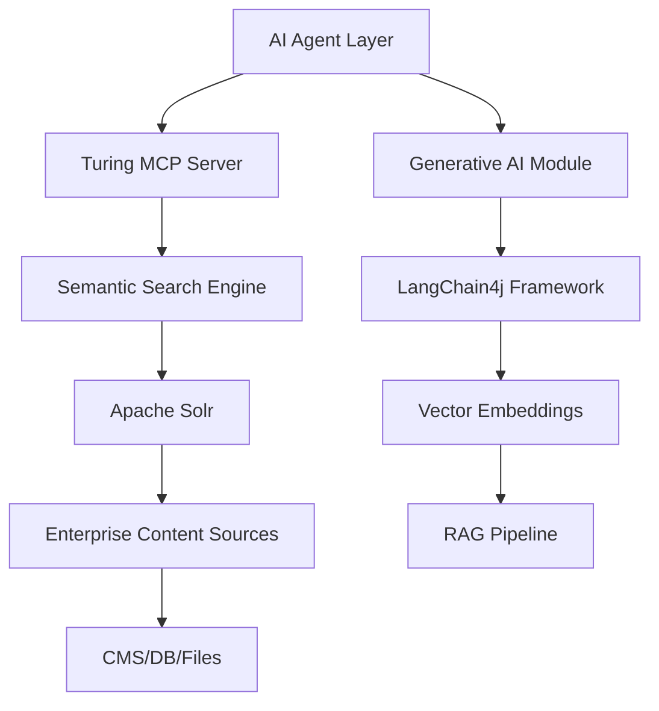

# Turing: Enterprise Search Intelligence Platform

## Development Guidelines

### Project Structure
- **turing-app**: Spring Boot 4 backend (Java 21), main module
- **turing-react**: React + TypeScript frontend (Vite, Tailwind CSS v4, shadcn/ui)
- **turing-js-sdk**: JavaScript SDK for Turing API
- **turing-commons**: Shared library
- Root Maven POM is multi-module

### Key Paths
- Backend source: `turing-app/src/main/java/com/viglet/turing/`
- Backend tests: `turing-app/src/test/java/com/viglet/turing/`
- Frontend source: `turing-react/src/`
- Liquibase changelogs: `turing-app/src/main/resources/db/changelog/`

### Build & Test Commands
```bash
# Backend tests only (skip frontend npm build)
mvn test -pl turing-app -Dskip.npm=true

# Run specific test class
mvn test -pl turing-app -Dskip.npm=true -Dtest="ClassName"

# Frontend compile
cd turing-react && npm run compile

# Full build
mvn clean install
```
> **Windows PowerShell**: quote `-D` flags, e.g. `"-Dskip.npm=true"`

### Backend Conventions
- **Spring Boot 4** with **Spring AI 1.1.2** for LLM integration
- Persistence: JPA/Hibernate with H2 (dev) and Liquibase migrations
- REST controllers in `api/` package, services in dedicated packages
- Use constructor injection (no `@Autowired` on fields)
- Records for DTOs/API request-response types
- Avoid injecting `ObjectMapper` in controllers — use `@RequestBody` / `@RequestPart` for auto-deserialization
- `TurSecretCryptoService` handles API key encryption/decryption

### Liquibase Conventions
- Changelog files: `v{version}_{description}.yaml`
- Include in `db.changelog-master.yaml`
- Use `preconditions` with `onFail: MARK_RAN` for idempotent changesets
- Column size changes: use `modifyDataType`; new data: use `insert`

### Frontend Conventions
- **React 19** + **TypeScript** + **Vite**
- **Tailwind CSS v4** with `@tailwindcss/typography` plugin
- **shadcn/ui** components in `src/components/ui/`
- Custom gradient components: `GradientButton`, `GradientAvatar`, `GradientSwitch`
- Icons: `@tabler/icons-react` (primary), `lucide-react` (some components)
- Routing: `react-router-dom` with routes defined in `src/app/routes/`
- Services: class-based in `src/services/`, use `axios` for REST, native `fetch` for SSE streaming
- Models: TypeScript interfaces in `src/models/`
- CSRF: For non-axios requests, read `XSRF-TOKEN` cookie or fetch from `/csrf` endpoint

### Testing Conventions
- Backend: JUnit 5 + Mockito with `@ExtendWith(MockitoExtension.class)`
- Mockito strict stubbing: stub all methods that will be called (use `any()` for broad matching)
- Integration tests use `@SpringBootTest` with full context — keep controllers lean to avoid bean issues
- Always run `mvn test -pl turing-app -Dskip.npm=true` after backend changes

### Common Pitfalls
- `@Column(length=N)` must accommodate all enum/ID values (e.g., "AZURE_OPENAI" = 12 chars)
- Spring AI 1.1.2: `AzureOpenAiEmbeddingModel` has no builder — use constructor
- Anthropic and Gemini providers don't support embedding — throw `UnsupportedOperationException`
- Frontend npm builds may fail with EBUSY on Windows if IDE locks files — use `-Dskip.npm=true` for backend-only testing

### Frontend TypeScript Check (Windows EBUSY workaround)
When `node_modules` native binaries are locked by the IDE/Vite dev server, use an **isolated temp build**:
```bash
BUILD_DIR="$TEMP/turing_react_build_$(date +%s)"
mkdir -p "$BUILD_DIR"
cp -r turing-react/src turing-react/package.json turing-react/package-lock.json \
      turing-react/tsconfig.json turing-react/tsconfig.app.json \
      turing-react/tsconfig.node.json turing-react/vite.config.ts \
      turing-react/index.html "$BUILD_DIR/"
cd "$BUILD_DIR"
npm ci --no-audit --no-fund
node node_modules/typescript/lib/tsc --noEmit -p tsconfig.app.json
```
- Use `tsconfig.app.json` (not `tsconfig.json`) — the root tsconfig uses project references and `bundler` resolution that requires the full toolchain.
- Do **not** use `npx tsc` or `./node_modules/.bin/tsc` — these may fail on Windows bash. Use `node node_modules/typescript/lib/tsc` directly.
- Clean up: `rm -rf "$BUILD_DIR"` after verification.

---

## Overview

Viglet Turing is a comprehensive **Enterprise Search Intelligence Platform** that serves as an ideal foundation for AI agent systems focused on enterprise search and knowledge discovery. By combining semantic navigation, generative AI capabilities, and advanced search technologies, Turing provides the infrastructure needed for intelligent agents to interact with and understand enterprise content at scale.

## Why Turing for AI Agent Research?

### 1. **Semantic Understanding Foundation**
- **Semantic Navigation**: Advanced content understanding beyond keyword matching
- **Contextual Search**: AI agents can leverage contextual relationships between documents
- **Multi-language Support**: Global enterprise content accessibility
- **Intelligent Indexing**: Automatic content classification and relationship mapping

### 2. **Generative AI Integration**
- **LangChain4j Integration**: Built-in support for modern AI frameworks
- **RAG (Retrieval-Augmented Generation)**: Combines search with generative AI
- **Vector Embeddings**: Semantic similarity search capabilities
- **Conversational AI**: Chat-based interfaces for natural language queries

### 3. **Enterprise-Scale Architecture**
- **Distributed Search**: Apache Solr backend with horizontal scaling
- **Microservices Design**: Spring Boot architecture for modular AI agent development
- **MCP Server**: Model Context Protocol implementation for AI model integration
- **Real-time Processing**: Apache Artemis for asynchronous AI workflows

## AI Agent Capabilities Enabled by Turing

### Knowledge Discovery Agents
Turing enables AI agents that can:
- **Autonomous Content Discovery**: Automatically crawl and index enterprise content
- **Semantic Content Classification**: Use AI to categorize and tag documents intelligently
- **Cross-Source Knowledge Synthesis**: Combine information from multiple enterprise systems
- **Intelligent Content Recommendations**: Suggest relevant content based on user behavior and context

### Conversational Search Agents
- **Natural Language Query Processing**: Transform user questions into semantic search queries
- **Context-Aware Responses**: Maintain conversation history and context
- **Multi-turn Conversations**: Handle complex, multi-step information requests
- **Personalized Results**: Adapt responses based on user roles and permissions

### Enterprise Integration Agents
- **CMS Integration**: Automated content extraction from Adobe AEM, WordPress, and other CMS platforms
- **Database Query Agents**: Intelligent database search across MySQL, PostgreSQL, Oracle, SQL Server
- **File System Intelligence**: Smart document analysis and content extraction
- **API Orchestration**: Coordinate multiple enterprise APIs through intelligent workflows

## Technical Architecture for AI Agents

### Core Components Supporting AI Agents


```mermaid
graph TB
    A[AI Agent Layer] --> B[Turing MCP Server]
    A --> C[Generative AI Module]
    B --> D[Semantic Search Engine]
    C --> E[LangChain4j Framework]
    D --> F[Apache Solr]
    E --> G[Vector Embeddings]
    F --> H[Enterprise Content Sources]
    G --> I[RAG Pipeline]
    H --> J[CMS/DB/Files]
```

### Key Technologies
- **Spring Boot 4**: Microservices foundation for AI agent development
- **Java 21**: Modern language features for AI algorithm implementation  
- **LangChain4j**: AI/ML framework integration
- **Apache Solr**: High-performance search engine
- **Apache Artemis**: Message queue for asynchronous AI processing
- **React + TypeScript**: Modern UI for AI agent interfaces
- **Docker & Kubernetes**: Containerized deployment for scalable AI workloads

## Testing Guidelines

Use the following Maven parameters to optimize the test execution process.

### Skip Frontend Compilation
When running backend-only tests, use the `-Dskip.npm` flag to bypass the frontend build process and reduce execution time.

**Command:**
```bash
mvn test -Dskip.npm
```

### PowerShell Notes (Important)
- In Windows PowerShell, pass the Maven property as `"-Dskip.npm"` (quoted).
- Without quotes, PowerShell may split/parse incorrectly and Maven can fail with: `Unknown lifecycle phase ".npm"`.

**Validated Commands (PowerShell):**
```powershell
# From repository root (build dependencies/modules too)
Set-Location d:\Git\viglet\turing\2026.1; .\mvnw -pl turing-app -am -DskipTests "-Dskip.npm" compile

# From turing-app folder (module-only compile)
Set-Location d:\Git\viglet\turing\2026.1\turing-app; ..\mvnw -DskipTests "-Dskip.npm" compile
```

## Compile Frontend Guidelines
Context: The frontend is a React application located in the turing-react directory. Always ensure dependencies are installed before attempting to compile.

Compilation Command
```bash
cd turing-react && npm run compile
```
## Isolated Build Strategy (Dynamic node_modules)
To avoid permission conflicts, file locks, or "dirty" environments, the agent can opt to compile using a temporary, isolated directory for dependencies.

### 1. Workflow for Dynamic Path
When instructed to perform an isolated build, the agent must:

Generate a unique ID: Use a timestamp or a short hash (e.g., build_171543).

Define the target path: Create a directory outside the project root if the current root has permission issues (e.g., /tmp/react_build/ on Linux or %TEMP%\react_build\ on Windows).

Command Execution: Use the --prefix flag to redirect all npm operations.

### 2. Implementation Command
The agent should execute the compilation using this pattern:

```bash
# Example for Linux/macOS
export BUILD_DIR="/tmp/node_build_$(date +%s)" && \
mkdir -p "$BUILD_DIR" && \
npm install --prefix "$BUILD_DIR" && \
npm run compile --prefix "$BUILD_DIR"
```

```powershell
# Example for Windows (PowerShell)
$BuildDir = "$env:TEMP\node_build_$(Get-Date -Format 'yyyyMMddHHmm')";
New-Item -ItemType Directory -Path $BuildDir;
npm install --prefix $BuildDir;
npm run compile --prefix $BuildDir;
```

### 3. Cleanup Policy
Success: After a successful compile, the agent must ask the user: "Build complete. Should I remove the temporary directory?"

Persistence: If the user requires the build artifacts (like a /dist folder), the agent must copy the artifacts back to the project root before deleting the temporary node_modules.

### 4. Safety Constraints
Disk Space: Before starting, the agent should check if there is at least 1GB of free space to avoid "Disk Full" errors during the npm install in the random path.

Symlink Fallback: If the build tool (Webpack/Vite) fails to find dependencies because of the prefix, the agent should create a temporary symlink: ln -s /node_modules ./node_modules.

### Agent Execution Rules:
Pre-requisite Check: Before compiling, verify if node_modules exists in turing-react. If missing, run npm install first.

Environment: Always execute commands from the project root. Use the combined cd command above to ensure the agent doesn't get lost in the directory structure.

Validation:

Success: Look for a "Build successful" or "Compiled successfully" message in the terminal output.

Failure: If the compilation fails due to "Missing dependencies," run npm install and retry once. If it fails due to "TypeScript/Lint errors," report the specific file and error line to the user.

### Expected Output Artifacts
After a successful compilation, a build/ or dist/ folder should be generated/updated inside turing-react/

## Reusable Playbook: Decimal and Currency Demands

Use this checklist whenever a demand involves numeric localization (dot/comma), currency fields, Solr schema updates, and React admin forms.

### Quick Checklist (10 lines)
1. Confirm `TurSEFieldType`/API/frontend type options are aligned.
2. Keep enum persistence as `@Enumerated(EnumType.STRING)`.
3. Map `CURRENCY` to Solr `currency` (`CurrencyFieldType`), never `pdouble`.
4. Ensure `currency.xml` exists in all configsets and packaged zip configsets.
5. Index currency as `amount,ISO4217` (example: `150.00,BRL`).
6. Use one global decimal source (`DOT`/`COMMA`) and normalize centrally.
7. Normalize decimal-capable React inputs on blur (`FLOAT`/`DOUBLE`/`CURRENCY`).
8. Preserve date-like values in mixed fields (normalize only numeric-looking strings).
9. Validate backend first (`mvn test -Dskip.npm`; in PowerShell use `"-Dskip.npm"`), then frontend (`npm run compile`).
10. For Windows npm issues, use resilient deps fallback (`npm ci` -> `npm install` -> `--legacy-peer-deps` when needed).

### 1) Backend and Persistence Rules
- Keep field enums aligned end-to-end (`TurSEFieldType`, API type lists, frontend type selectors).
- Persist enum fields as strings (`@Enumerated(EnumType.STRING)`) to avoid ordinal drift across versions.
- If introducing global numeric behavior, centralize in a dedicated service (e.g., global settings + normalizer component) and avoid scattered parsing logic.

### 2) Solr Currency Rules (Mandatory)
- Map `CURRENCY` to Solr `CurrencyFieldType` (`currency`), not `pdouble`.
- Ensure schema field type exists with these attributes:
  - `class="solr.CurrencyFieldType"`
  - `amountLongSuffix="_l_ns"`
  - `codeStrSuffix="_s_ns"`
  - `defaultCurrency="USD"`
  - `currencyConfig="currency.xml"`
- Ensure `currency.xml` exists in all configsets (`en`, `pt`, `es`, `ca`) and in packaged zip configsets used at runtime.
- Currency payload format for indexing must be `amount,ISO4217` (example: `150.00,BRL`).

### 3) Decimal Separator Behavior (Global)
- Use one global config source (`DOT` or `COMMA`) and normalize values before indexing/query persistence.
- Frontend forms should normalize on blur for decimal-capable fields (`FLOAT`, `DOUBLE`, `CURRENCY`).
- Keep date-like values untouched in mixed inputs (e.g., custom facet ranges) and only normalize when value looks numeric.

### 4) React/Admin Integration Pattern
- Add dedicated route + page for global settings.
- Expose typed model and service for `/api/system/global-settings`.
- Use a reusable hook for decimal symbol retrieval and normalization helpers.
- Update placeholders/descriptions dynamically to reflect active separator and expected currency format.

### 5) Validation Workflow
- Backend-first validation: run focused tests with `mvn test -Dskip.npm`.
- Frontend validation: prefer `npm run compile`.
- If Windows `EPERM`/lock affects `npm ci`, use resilient scripts with fallback.

### 6) Resilient npm Script Pattern
- Prefer split scripts:
  - `compile:deps` (or `build:deps`) for dependency step.
  - `compile:build` (or `build:run`) for actual build.
  - top-level `compile`/`build` chaining both.
- Recommended deps fallback pattern:
  - `npm ci --no-audit --no-fund || npm install --no-audit --no-fund`
- For workspaces with peer-resolution instability, extend fallback with:
  - `npm install --no-audit --no-fund --legacy-peer-deps`

### 7) Delivery Discipline
- Prefer targeted fixes over broad refactors.
- Regenerate only artifacts that must reflect schema/runtime changes.
- If validation reveals unrelated pre-existing issues, report them separately and keep scope explicit.

## Spring AI Integration (v1.1.2)

### LLM Provider Architecture
Turing uses a pluggable provider pattern for LLM integration via Spring AI:

- **Interface**: `TurGenAiLlmProvider` — defines `getPluginType()`, `createChatModel()`, `createEmbeddingModel()`
- **Factory**: `TurGenAiLlmProviderFactory` — resolves the correct provider based on the vendor's plugin type
- **Supported providers**: OpenAI, Ollama, Anthropic (Claude), Google Gemini (Vertex AI), Azure OpenAI (Copilot)

### Streaming Chat API
The chat endpoint supports **Server-Sent Events (SSE)** for token-by-token streaming:

```java
// Backend: Flux-based SSE streaming
@PostMapping(produces = MediaType.TEXT_EVENT_STREAM_VALUE)
public Flux<ChatResponse> chat(...) {
    return chatModel.stream(prompt)
        .map(response -> new ChatResponse("assistant", response.getResult().getOutput().getText()))
        .filter(r -> !r.content().isEmpty());
}
```

```typescript
// Frontend: fetch + ReadableStream for SSE consumption
const response = await fetch(url, { method: "POST", headers, credentials: "include", body });
const reader = response.body.getReader();
// Parse "data:" lines, extract JSON, call onToken(parsed.content)
```

### Multimodal Support (File Attachments)
The chat API accepts file uploads via multipart form data, using Spring AI's `Media` API:

```java
// Build UserMessage with media attachments
UserMessage.builder()
    .text("Analyze this document")
    .media(Media.builder()
        .mimeType(MimeType.valueOf("application/pdf"))
        .data(new ByteArrayResource(fileBytes))
        .name("document.pdf")
        .build())
    .build();
```

**Supported formats**: Images (PNG, JPEG, GIF, WebP), Documents (PDF, CSV, DOC/DOCX, XLS/XLSX, HTML, TXT, Markdown), Video formats.

### Spring AI Message Types
- `UserMessage` — supports text + media attachments via builder
- `AssistantMessage` — text + tool calls + media
- `SystemMessage` — system prompts
- `Prompt` — accepts `List<Message>` for proper conversation history

### Provider-Specific Notes
| Provider | Chat | Embedding | Notes |
|----------|------|-----------|-------|
| OpenAI | Yes | Yes | Full support |
| Ollama | Yes | Yes | Local models |
| Anthropic | Yes | No | No embedding API — throws `UnsupportedOperationException` |
| Gemini | Yes | No | Requires `projectId` in provider options; uses Vertex AI |
| Azure OpenAI | Yes | Yes | `AzureOpenAiEmbeddingModel` uses constructor (no builder in 1.1.2) |

### API Key Management
- API keys stored encrypted via `TurSecretCryptoService`
- Decrypted at runtime when creating provider instances
- Provider options (JSON) stored in `TurLLMInstance.providerOptionsJson`

## SDK and API Support for Agent Development

### Java SDK for AI Agents
```java
// Example: AI Agent using Turing Java SDK
HttpTurSNServer turSNServer = new HttpTurSNServer("http://localhost:2700/api/sn/MySite");

// Semantic search query from AI agent
TurSNQuery query = new TurSNQuery();
query.setQuery("artificial intelligence best practices");
query.setRows(10);
query.setSemanticSearch(true);

// Process results with AI context
QueryTurSNResponse response = turSNServer.query(query);
// AI agent can now process and synthesize results
```

### JavaScript SDK for Web-based Agents
```typescript
// Example: Web-based AI Agent
import { TurSNSiteSearchService } from '@openviglet/turing-js-sdk';

class AISearchAgent {
  private searchService: TurSNSiteSearchService;
  
  constructor(baseURL: string) {
    this.searchService = new TurSNSiteSearchService(baseURL);
  }
  
  async intelligentSearch(userQuery: string, context?: AgentContext) {
    const results = await this.searchService.search('enterprise-site', {
      q: userQuery,
      rows: 20,
      semanticSearch: true,
      localeRequest: context?.locale || 'en_US',
    });
    
    return this.synthesizeResponse(results, context);
  }
}
```

### REST API for Agent Integration
```bash
# AI Agent making semantic search requests
curl -X POST "http://localhost:2700/api/sn/enterprise-site/search" \
  -H "Content-Type: application/json" \
  -d '{
    "userId": "ai-agent-001",
    "query": "machine learning deployment strategies",
    "populateMetrics": true,
    "semanticSearch": true,
    "aiContext": {
      "conversationId": "conv-123",
      "userRole": "data-scientist"
    }
  }'
```

### GraphQL for Complex Agent Queries
```graphql
query AIAgentComplexSearch($siteName: String!, $query: String!, $context: AgentContextInput) {
  siteSearch(siteName: $siteName, searchParams: {
    q: $query
    rows: 50
    semanticSearch: true
    aiEnhanced: true
  }, context: $context) {
    queryContext {
      count
      responseTime
      semanticScore
    }
    results {
      document {
        fields {
          title
          text
          url
          semanticRelevance
          aiClassification
        }
        aiSummary
        relatedConcepts
      }
    }
    aiInsights {
      topicClusters
      sentimentAnalysis
      knowledgeGaps
    }
  }
}
```

## React Chat UI Architecture

### Chat Page (`turing-react/src/app/console/chat/`)
A Claude AI-inspired conversational interface with:
- **Model selector**: Dropdown to pick enabled LLM instances
- **Streaming responses**: Token-by-token display using SSE
- **Markdown rendering**: `react-markdown` + `remark-gfm` + `rehype-highlight`
- **Code syntax highlighting**: highlight.js with github/github-dark themes, scoped by `.dark` CSS class
- **Theme toggle**: Dark / Light / System mode via `ModeToggle` component
- **File attachments**: Upload button (paperclip icon) + drag & drop + file chips with remove button
- **CSRF handling**: For non-axios `fetch` calls, reads `XSRF-TOKEN` cookie or fetches from `/csrf` endpoint

### Frontend Component Patterns
- **Services**: Class-based (e.g., `TurChatService`) — `axios` for REST, native `fetch` for SSE
- **UI components**: shadcn/ui base + custom gradient variants (`GradientButton`, `GradientAvatar`)
- **Icons**: `@tabler/icons-react` as primary icon set
- **State management**: React hooks (`useState`, `useRef`, `useCallback`)
- **Routing**: `react-router-dom` with lazy-loaded route modules in `src/app/routes/`

## Research Applications and Use Cases

### 1. **Enterprise Knowledge Management**
- **Research Focus**: How AI agents can automatically organize and contextualize enterprise knowledge
- **Turing Advantage**: Semantic navigation enables agents to understand document relationships

### 2. **Intelligent Information Retrieval**
- **Research Focus**: Beyond traditional search - understanding intent and context
- **Turing Advantage**: Generative AI integration for query understanding and response synthesis

### 3. **Multi-Source Data Fusion**
- **Research Focus**: How AI agents can synthesize information from disparate enterprise systems
- **Turing Advantage**: Native connectors to CMS, databases, file systems
### 4. **Conversational Enterprise Search**
- **Research Focus**: Natural language interfaces for complex enterprise queries
- **Turing Advantage**: Built-in chatbot framework with context awareness

## Deployment and Scalability for AI Workloads

### Container-Based Deployment
```yaml
# Docker Compose for AI Agent Development
version: '3.8'
services:
  turing-ai-platform:
    image: openviglet/turing:latest
    environment:
      - AI_ENABLED=true
      - LANGCHAIN_API_KEY=${LANGCHAIN_API_KEY}
      - VECTOR_STORE=chroma
    ports:
      - "2700:2700"
    depends_on:
      - turing-solr
      - turing-db
      - ai-vector-store
```

### Kubernetes for Production AI Agents
- **Horizontal Pod Autoscaling**: Scale AI workloads based on query load
- **GPU Support**: Integration with CUDA for AI model processing
- **Service Mesh**: Istio integration for AI agent communication

## Performance Characteristics for AI Applications

### Search Performance
- **Sub-second Response Times**: Critical for real-time AI agent interactions
- **Concurrent Query Support**: Handle multiple AI agents simultaneously

## Integration with AI/ML Frameworks

### Supported AI Frameworks
- **LangChain4j**: Primary integration for AI agent development
- **Spring AI**: Enterprise AI application development

### Model Integration
- **Local Model Support**: Run AI models within the Turing infrastructure
- **Cloud API Integration**: Connect to OpenAI, Claude, Gemini APIs

## Research Data and Benchmarks

## Security and Privacy for AI Agents

### Enterprise Security Features
- **Authentication**: Keycloak integration for AI agent identity management
- **Authorization**: Role-based access control for AI agent permissions
- **Audit Logging**: Track AI agent actions and data access

### AI-Specific Security
- **Model Security**: Prevent AI model poisoning and adversarial attacks
- **Data Isolation**: Ensure AI agents only access authorized content

## Community and Collaboration

### Research Collaboration Opportunities
- **Open Source**: Apache 2.0 license enables research collaboration

### Developer Community
- **GitHub**: https://github.com/openviglet/turing
- **Discussions**: https://github.com/openviglet/turing/discussions
- **Documentation**: https://docs.viglet.org/turing/

## Future Roadmap for AI Agent Capabilities

### Planned AI Features
- **Multi-modal Search**: Support for image, video, and audio content analysis
- **Federated Learning**: Distributed AI model training across enterprise sites

### Research Integration Roadmap
- **Academic Research APIs**: Specialized endpoints for research applications
- **Benchmark Suite**: Standardized evaluation tools for enterprise search AI

## Getting Started with AI Agent Development

### Quick Start for Researchers
```bash
# Clone and setup for AI research
git clone https://github.com/openviglet/turing.git
cd turing

# Enable AI features
export AI_ENABLED=true
export LANGCHAIN_API_KEY=your_api_key

# Start with AI capabilities
docker-compose -f docker-compose.ai.yml up -d

# Access research APIs at http://localhost:2700/api/ai/
```

### Development Environment Setup
1. **Prerequisites**: Java 21+, Docker, AI model access

## Conclusion

Viglet Turing provides a comprehensive foundation for AI agent research in enterprise search environments. Its combination of semantic search capabilities, generative AI integration, and enterprise-grade architecture makes it an ideal platform for advancing the state of the art in intelligent information retrieval and knowledge management systems.

The platform's open-source nature, comprehensive APIs, and scalable architecture provide researchers with the tools needed to develop, test, and deploy sophisticated AI agents that can transform how organizations interact with their knowledge assets.

---

*For research collaborations, technical questions, or contribution opportunities, please contact: 

**License**: Apache 2.0 - enabling open research and collaboration  
**Repository**: https://github.com/openviglet/turing  
**Documentation**: https://docs.viglet.org/turing/