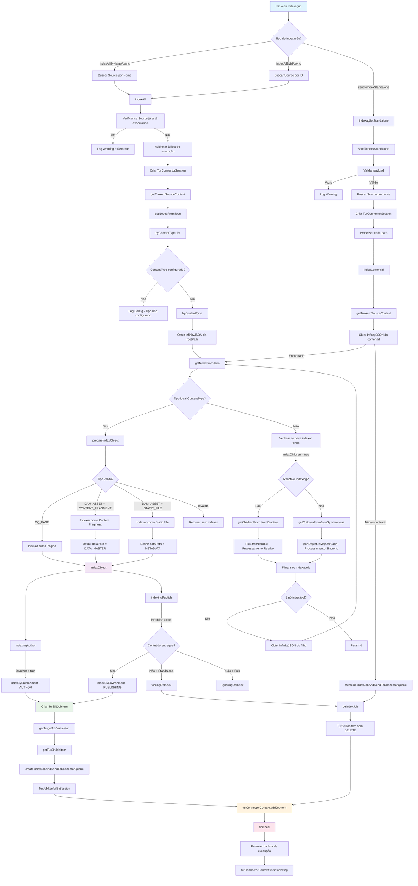
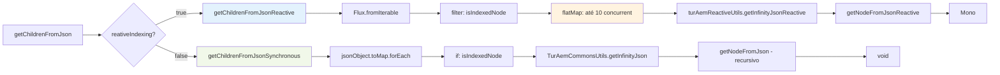
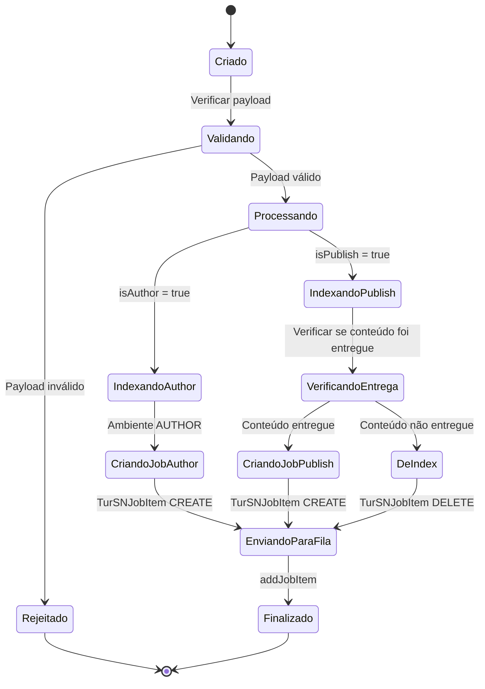
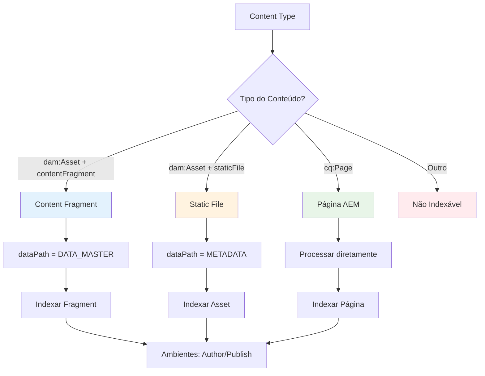

# TurAemPluginProcess - Diagrama de Fluxo

## Visão Geral do Processo de Indexação do AEM



## Fluxo de Processamento Reativo vs Síncrono



## Estados de um Job de Indexação



## Tipos de Conteúdo Suportados



## Configurações e Dependências

```mermaid
graph TD
    A[@Value Annotations] --> B[turing.url]
    A --> C[turing.apiKey]
    A --> D[turing.connector.dependencies.enabled]
    A --> E[turing.connector.reactive.indexing]
    
    F[Repositories] --> G[TurAemSourceRepository]
    F --> H[TurAemAttributeSpecificationRepository]
    F --> I[TurAemPluginSystemRepository]
    F --> J[TurAemTargetAttributeRepository]
    
    K[Services] --> L[TurAemContentMappingService]
    K --> M[TurAemAttrProcess]
    K --> N[TurAemReactiveUtils]
    
    O[Context] --> P[TurConnectorContext]
    O --> Q[TurAemSourceContext]
    
    style A fill:#e1f5fe
    style F fill:#f3e5f5
    style K fill:#e8f5e8
    style O fill:#fff3e0
```
